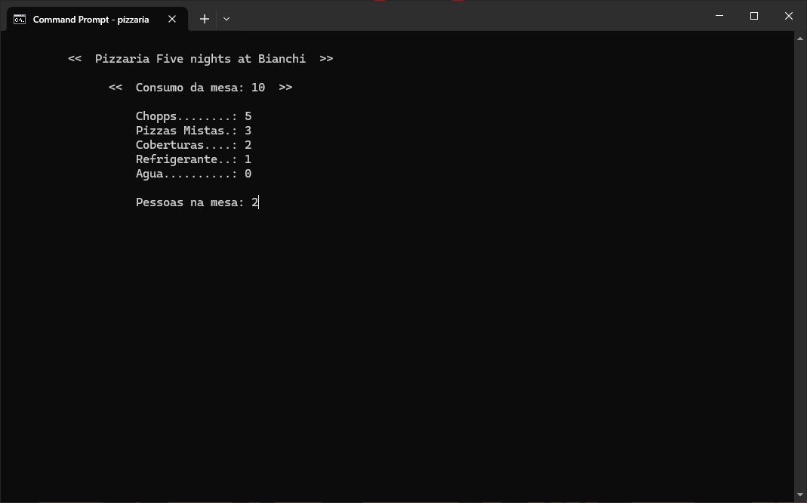
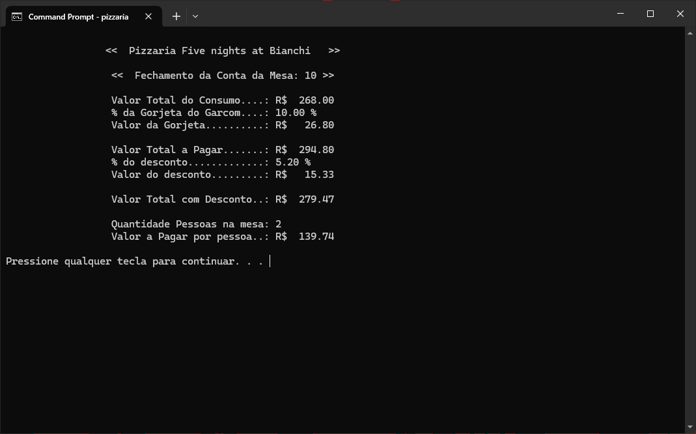
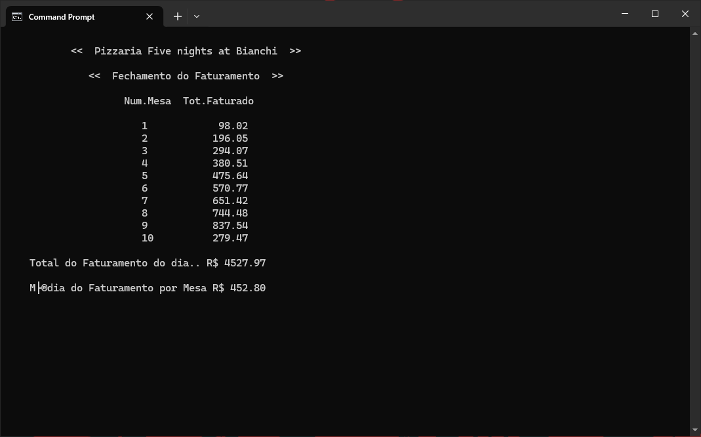

# 🍕 Projeto Pizzaria

Sistema de gerenciamento de consumo e faturamento de uma pizzaria desenvolvido em **C++** como atividade da disciplina de **Algoritmos e Lógica de Programação**.

O programa permite registrar o consumo de cada mesa, calcular gorjetas e descontos automaticamente, dividir a conta entre os clientes e gerar um relatório final de faturamento ao encerrar o sistema.

---

## 👨‍💻 Integrantes do Grupo 04

* [Cesar Henrique](https://github.com/cesarhenrique03)
* [Daniel de Freitas](https://github.com/BlackDani557)
* [Davi Dias Campos](https://github.com/davicampos-crypto)
* [Guilherme Costa](https://github.com/cdGuilherme)
* [Marcos Vinicius](https://github.com/MarcosV1ni)

---

## ✨ Destaques

* Controle de consumo de até 10 mesas.
* Cálculo automático de gorjeta e descontos.
* Divisão da conta por número de pessoas.
* Relatório consolidado de faturamento diário.
* Interface em modo texto com posicionamento dinâmico do cursor.
* Projeto acadêmico desenvolvido para aplicação prática de conceitos de programação em C++.

---

## 📚 Objetivo

O projeto foi desenvolvido com o objetivo de aplicar conceitos fundamentais de programação, tais como:

* Estruturas de decisão (`if`, `else`);
* Estruturas de repetição (`for`, `do...while`);
* Vetores;
* Manipulação de variáveis;
* Entrada e saída de dados;
* Validação de informações;
* Cálculos matemáticos e financeiros;
* Organização e estruturação de programas em C++.

---

## ⚙️ Funcionalidades

### Cadastro de Consumo por Mesa

O sistema registra:

* Número da mesa;
* Quantidade de chopps;
* Quantidade de pizzas mistas;
* Quantidade de coberturas;
* Quantidade de refrigerantes;
* Quantidade de águas;
* Quantidade de pessoas na mesa.

### Validação de Dados

O programa realiza validações para evitar inconsistências:

* O número da mesa deve estar entre 1 e 10;
* A mesa 0 encerra o programa;
* Não é permitido informar cobertura sem pizza;
* Não é permitido informar pizza sem cobertura;
* A quantidade de pessoas deve ser maior que zero.

### Cálculo Automático

Após o cadastro dos pedidos, o sistema calcula:

* Valor total consumido;
* Gorjeta do garçom;
* Valor total da conta;
* Desconto aplicado;
* Valor final a pagar;
* Valor por pessoa.

---

## 💰 Tabela de Preços

| Produto      |    Valor |
| ------------ | -------: |
| Chopp        | R$ 15,00 |
| Pizza Mista  | R$ 55,00 |
| Cobertura    | R$ 10,00 |
| Refrigerante |  R$ 8,00 |
| Água         |  R$ 6,00 |

### Gorjeta

* 10% sobre o valor total consumido.

### Política de Descontos

| Valor da Conta     | Desconto |
| ------------------ | -------: |
| Até R$ 400,00      |    5,20% |
| Até R$ 700,00      |    8,00% |
| Acima de R$ 700,00 |   10,00% |

---

## 📸 Exemplo de Execução

A seguir são apresentadas algumas capturas de tela demonstrando o fluxo de utilização do sistema.

### 1. Tela Inicial

Nesta etapa são informados os dados de consumo da mesa, incluindo os produtos consumidos e a quantidade de pessoas presentes.



### 2. Fechamento da Conta da Mesa

Após o registro do consumo, o sistema realiza automaticamente os cálculos de gorjeta, desconto, valor final da conta e valor por pessoa.



### 3. Relatório de Faturamento

Ao encerrar o sistema informando a mesa **0**, é exibido um relatório contendo o faturamento acumulado por mesa, o faturamento total do dia e a média das mesas atendidas.



---

## 💻 Tecnologias Utilizadas

* C++
* Biblioteca padrão (`stdio.h`, `stdlib.h`)
* `locale.h`
* `windows.h`
* Aplicação em modo console

---

## 🏗️ Estrutura do Projeto

```text
projeto-pizzaria/
│
├── .gitattributes
├── .gitignore
├── pizzaria.cpp
├── README.md
│
└── img/
    ├── telaInicial.png
    ├── telaSaida1.png
    └── telaSaida2.png
```

## 🚀 Como Compilar e Executar

### Utilizando G++

```bash
g++ pizzaria.cpp -o pizzaria
```

> **Observação:** o projeto utiliza a biblioteca `windows.h` e foi desenvolvido para ambiente Windows. Para compilação em outros sistemas operacionais, serão necessárias adaptações nas funções de manipulação do console.

### Executando o programa

```bash
pizzaria.exe
```

---

## 🖥️ Compatibilidade

O projeto foi desenvolvido para ambiente **Windows**, utilizando a biblioteca `windows.h` para manipulação da posição do cursor na tela através da função `gotoxy()`.

Caso seja executado em Linux ou macOS, será necessário adaptar as funções relacionadas à interface do console.

---

## 🎓 Conceitos Trabalhados

Durante o desenvolvimento deste projeto foram aplicados conceitos como:

* Programação estruturada;
* Manipulação de vetores;
* Validação de entradas;
* Controle de fluxo;
* Operações matemáticas;
* Organização de código;
* Desenvolvimento de aplicações em terminal.

---

## 📌 Observações

Este projeto foi desenvolvido para fins acadêmicos como atividade da disciplina de Algoritmos e Lógica de Programação.
